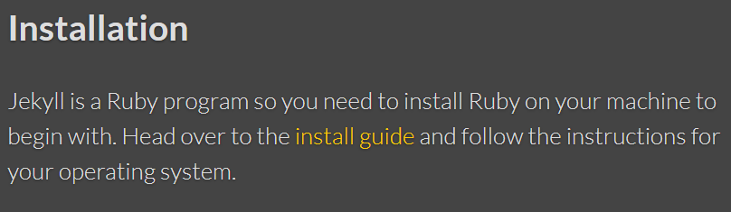
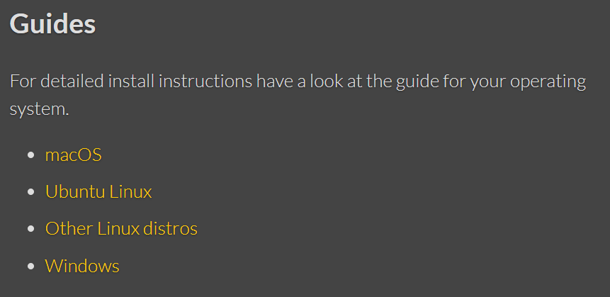

1.Setelah kita menginstall git dan juga sudah membuat akun github, maka mari kita coba untuk menginstall Jekyll dengan cara berikut :

  a.https://jekyllrb.com/docs/step-by-step/01-setup/

  b.Pilih install guide
  
  

  c.Pilih salah satu guide bergantung operating system Kita
  
  

  d.Kemudian ikuti petunjuk dari salah satu guide tersebut. Pelan-pelan saja, tidak usah terburu-terburu.

  e.Setelah itu mari kita masuk ke Quickstart pada Jekyll
  https://jekyllrb.com/docs/

  f.Karena kita sudah melakukan instruksi pertama, maka kita dapat menjalankan instruksi kedua yaitu menginstall jekyll bundler.

  ```PS
  "gem install jekyll bundler"
  ```
