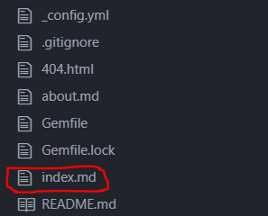
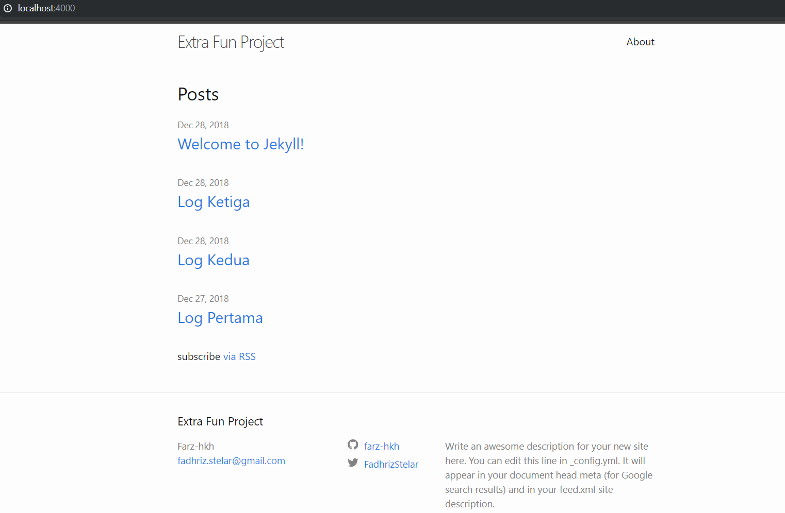

2.Sekarang kita akan membahas mengenai proses jekyll.

3.Kita tentu memerlukan ruby bersama devkit beserta jekyllnya.

4.Tentu ini tidak sama sekali dengan github pages yang dapat diedit melalui README.md

5.Pada github pages yang berintegrasi jekyll ini kita dapat mengedit di bagian index.md



6.Setelah itu kita akan membuat website dan menjadikan lokal dengan command

```PS
"bundle exec jekyll serve"
```

7.Kemudian jika tidak ada masalah, maka kita dapat menuju ke server lokal yaitu

```PS
"http://localhost:4000"
```

Sehingga hasilnya menjadi


